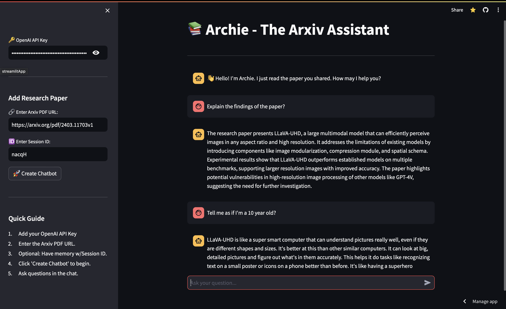

# Archie: arXiv Research Paper Chatbot

Archie is a Streamlit conversational RAG assistant for asking grounded questions
about arXiv research papers. It loads a paper, retrieves relevant passages, and
uses Groq to generate concise answers based on the retrieved evidence.



Try the live demo: [Open Archie](https://researchpaperchatbot-htfeuspv8peraj9aqdjnpd.streamlit.app/).

## Features

- Load papers from arXiv URLs, abstract URLs, or paper IDs.
- Parse papers with `ArxivLoader` and PyMuPDF.
- Create local FastEmbed embeddings and search them with FAISS.
- Ask follow-up questions through a history-aware LangChain RAG chain.
- Generate answers with Groq and stream them in the Streamlit interface.

## Architecture

```text
arXiv paper -> ArxivLoader/PyMuPDF -> text chunks -> FastEmbed -> FAISS
	-> LangChain retrieval chain -> Groq answer generation -> Streamlit chat
```

## Setup

Use Python 3.10 or 3.11 for the supported FAISS and LangChain dependency set.

```bash
git clone https://github.com/VansDubey/ResearchPaperChatbot.git
cd ResearchPaperChatbot

conda create --name rag-arxiv-bot python=3.10 -y
conda activate rag-arxiv-bot
pip install -r requirements.txt
```

Create a `.env` file from `.env.example` and add your Groq API key.

## Usage

```bash
streamlit run streamlit_app.py
```

For architecture details and interview preparation, see
[INTERVIEW_GUIDE.md](INTERVIEW_GUIDE.md).

## Tests

Run the focused unit-test suite with:

```bash
python -m unittest discover -s tests -v
```

The tests cover arXiv identifier validation, paper-scoped session memory,
prompt-injection guardrails, and grounded-answer prompt behavior.

## Tech Stack

- **Programming Language**: Python
- **Libraries**: Streamlit, FAISS, PyMuPDF (used by `ArxivLoader`)
- **AI**: LangChain, RAG, Groq, FastEmbed

## Current scope

- **Implemented**: arXiv ingestion, local embeddings, FAISS retrieval,
  conversational memory, Groq generation, Streamlit UI, and Docker support.
- **Not yet measured**: retrieval quality, answer accuracy, citation accuracy,
  and the best `k` or chunk-overlap configuration.
- **Limitations**: chat history and vector indexes are process-local. The demo
  does not yet provide authentication, rate limiting, or persistent storage.
- **Model serving**: the application uses Groq for chat inference and FastEmbed
  locally for embeddings. KServe and vLLM are not implemented.

## Docker

```bash
docker build -t archie-rag .
docker run --rm -p 8501:8501 -e GROQ_API_KEY=your_groq_key archie-rag
```

## Project links

- [Source repository](https://github.com/VansDubey/ResearchPaperChatbot)
- [Live demo](https://researchpaperchatbot-htfeuspv8peraj9aqdjnpd.streamlit.app/)
